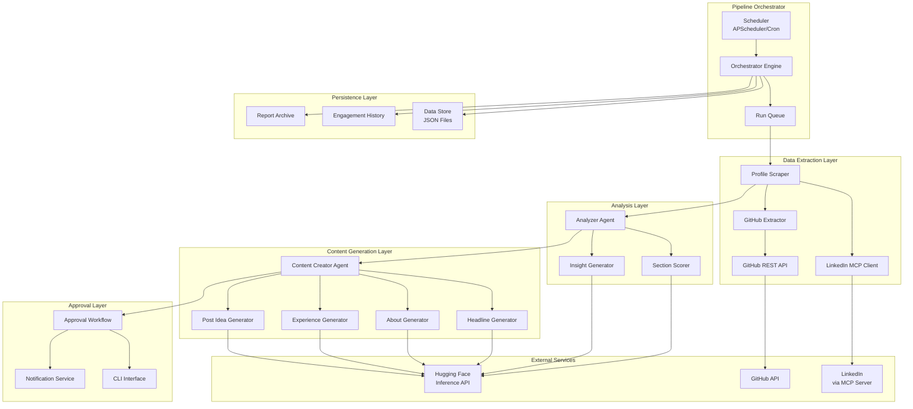
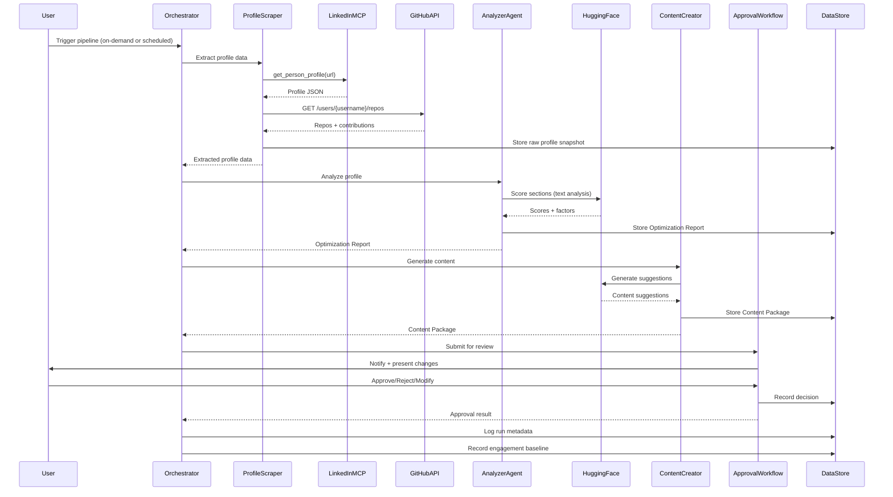
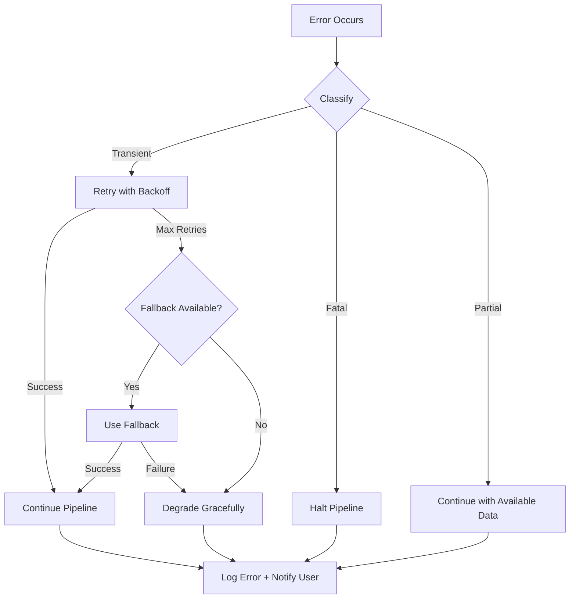

# Design Document: LinkedIn Profile Optimizer

## Overview

The LinkedIn Profile Optimizer is a Python-based multi-agent pipeline that automates the analysis, scoring, and optimization of a user's LinkedIn profile. The system orchestrates three primary agents — Profile Scraper, Analyzer Agent, and Content Creator Agent — through a sequential pipeline with a human-in-the-loop approval workflow.

The architecture follows a modular pipeline pattern where each stage produces structured output consumed by the next. External integrations (LinkedIn via MCP, GitHub via REST API, Hugging Face for AI) are abstracted behind adapter interfaces, making the system testable and extensible.

**Key Design Decisions:**
- **MCP-based LinkedIn access**: Uses `linkedin-mcp-server` (stickerdaniel) via MCP protocol for profile data extraction, providing authenticated browser-based scraping through Patchright.
- **Hugging Face for AI**: Leverages HF Inference API for both analysis (scoring/insights) and content generation, with configurable model selection and fallback support.
- **JSON file persistence**: Uses JSON files for data storage (profile snapshots, reports, engagement history) for simplicity and portability — no database server required.
- **CLI-first approval workflow**: Implements a terminal-based review interface for content approval, with optional webhook notifications.
- **Cron-based scheduling**: Uses system cron or APScheduler for periodic execution, with on-demand triggers via CLI.

## Architecture

### System Architecture Diagram



### Data Flow



## Components and Interfaces

### 1. Pipeline Orchestrator (`orchestrator.py`)

The central coordination component that manages pipeline execution lifecycle.

```python
from dataclasses import dataclass
from enum import Enum
from typing import Optional
from datetime import datetime


class PipelineStatus(Enum):
    IDLE = "idle"
    RUNNING = "running"
    COMPLETED = "completed"
    FAILED = "failed"
    PAUSED = "paused"


class ScheduleInterval(Enum):
    DAILY = "daily"
    WEEKLY = "weekly"
    MONTHLY = "monthly"


@dataclass
class PipelineConfig:
    linkedin_profile_url: str
    github_username: Optional[str]
    schedule_interval: Optional[ScheduleInterval]
    analyzer_model_id: str
    content_model_id: str
    fallback_model_id: str
    data_dir: str  # Path for JSON file storage
    max_retries: int = 3
    timeout_seconds: int = 30


@dataclass
class RunMetadata:
    run_id: str
    start_time: datetime
    end_time: Optional[datetime]
    status: PipelineStatus
    summary: Optional[str]
    error: Optional[str]


class PipelineOrchestrator:
    """Coordinates sequential execution of pipeline stages."""

    def __init__(self, config: PipelineConfig): ...

    async def execute(self) -> RunMetadata:
        """Execute full pipeline: scrape → analyze → generate → approve."""
        ...

    async def trigger_on_demand(self) -> RunMetadata:
        """Trigger immediate pipeline execution."""
        ...

    def schedule(self, interval: ScheduleInterval) -> None:
        """Configure scheduled execution."""
        ...

    def pause(self) -> None:
        """Pause scheduled execution."""
        ...

    def resume(self) -> None:
        """Resume scheduled execution."""
        ...

    def get_status(self) -> PipelineStatus:
        """Return current pipeline status."""
        ...

    def enqueue_run(self) -> str:
        """Queue a run if pipeline is busy. Returns queue position."""
        ...
```

### 2. Profile Scraper (`scrapers/linkedin_scraper.py`)

Extracts profile data via the LinkedIn MCP Server.

```python
from dataclasses import dataclass, field
from typing import Optional


@dataclass
class ProfileData:
    headline: str = ""
    about: str = ""
    experience: list[dict] = field(default_factory=list)
    skills: list[dict] = field(default_factory=list)
    endorsements: list[dict] = field(default_factory=list)
    posts: list[dict] = field(default_factory=list)
    banner_url: Optional[str] = None
    photo_url: Optional[str] = None
    education: list[dict] = field(default_factory=list)
    certifications: list[dict] = field(default_factory=list)
    follower_count: int = 0
    connection_count: int = 0
    profile_views: Optional[int] = None


@dataclass
class ExtractionResult:
    success: bool
    profile_data: Optional[ProfileData]
    failed_sections: list[str] = field(default_factory=list)
    error_message: Optional[str] = None


class LinkedInMCPClient:
    """Adapter for linkedin-mcp-server MCP tools."""

    def __init__(self, mcp_server_config: dict): ...

    async def get_person_profile(self, profile_url: str) -> dict:
        """Calls MCP tool: get_person_profile."""
        ...

    async def get_my_profile(self) -> dict:
        """Calls MCP tool: get_my_profile."""
        ...

    async def get_feed(self, count: int = 10) -> list[dict]:
        """Calls MCP tool: get_feed for recent post data."""
        ...


class ProfileScraper:
    """Extracts LinkedIn profile data with retry logic."""

    def __init__(self, mcp_client: LinkedInMCPClient, max_retries: int = 3): ...

    async def extract(self, profile_url: str) -> ExtractionResult:
        """Extract all profile sections with exponential backoff retry."""
        ...

    def _parse_profile_response(self, raw_data: dict) -> ProfileData:
        """Parse MCP response into structured ProfileData."""
        ...

    async def _retry_with_backoff(self, operation, max_attempts: int = 3) -> dict:
        """Retry with exponential backoff starting at 2 seconds."""
        ...
```

### 3. GitHub Extractor (`scrapers/github_extractor.py`)

```python
from dataclasses import dataclass, field
from typing import Optional


@dataclass
class GitHubRepo:
    name: str
    description: Optional[str]
    stars: int
    primary_language: Optional[str]
    is_pinned: bool = False
    url: str = ""


@dataclass
class GitHubContributions:
    total_commits_12m: int = 0
    total_prs_12m: int = 0
    total_issues_12m: int = 0
    commits_per_week_avg: float = 0.0


@dataclass
class GitHubData:
    repos: list[GitHubRepo] = field(default_factory=list)
    contributions: GitHubContributions = field(default_factory=GitHubContributions)
    pinned_repos: list[GitHubRepo] = field(default_factory=list)
    languages: dict[str, int] = field(default_factory=dict)  # language -> bytes
    notable_repos: list[GitHubRepo] = field(default_factory=list)  # 5+ stars or pinned


@dataclass
class GitHubExtractionResult:
    success: bool
    data: Optional[GitHubData]
    partial: bool = False  # True if some data unavailable
    unavailable_categories: list[str] = field(default_factory=list)
    error_message: Optional[str] = None


class GitHubExtractor:
    """Extracts GitHub profile data via REST API."""

    def __init__(self, username: str, timeout: int = 15): ...

    async def extract(self) -> GitHubExtractionResult:
        """Extract repos, contributions, and languages within 30s."""
        ...

    async def _get_repos(self) -> list[GitHubRepo]: ...
    async def _get_contributions(self) -> GitHubContributions: ...
    async def _get_pinned_repos(self) -> list[GitHubRepo]: ...
    def _identify_notable_repos(self, repos: list[GitHubRepo]) -> list[GitHubRepo]: ...
```

### 4. Analyzer Agent (`agents/analyzer_agent.py`)

```python
from dataclasses import dataclass, field
from enum import Enum
from typing import Optional


class Priority(Enum):
    HIGH = "high"
    MEDIUM = "medium"
    LOW = "low"


@dataclass
class FactorScore:
    factor_name: str
    score: int  # 0-100
    explanation: str


@dataclass
class SectionScore:
    section_name: str
    overall_score: int  # 0-100 weighted average
    factor_scores: list[FactorScore]
    missing: bool = False  # True if section has no data
    excluded_factors: list[str] = field(default_factory=list)


@dataclass
class Recommendation:
    element: str  # The specific element to change
    modification: str  # The modification description
    priority: Priority
    guideline_reference: str  # LinkedIn optimization guideline cited
    expected_impact: str


@dataclass
class SectionInsight:
    section_name: str
    strengths: list[str]
    weaknesses: list[str]
    recommendations: list[Recommendation]


@dataclass
class OptimizationReport:
    sections: list[SectionScore]
    insights: list[SectionInsight]
    overall_score: int  # Weighted average of all sections
    github_summary: Optional[str] = None
    excluded_sections: list[str] = field(default_factory=list)
    generated_at: str = ""


class AnalyzerAgent:
    """Scores profile sections and generates actionable insights."""

    def __init__(self, model_id: str, fallback_model_id: str, hf_client): ...

    async def analyze(
        self, profile: ProfileData, github: Optional[GitHubData]
    ) -> OptimizationReport:
        """Run full analysis pipeline."""
        ...

    async def score_section(self, section_name: str, content: str) -> SectionScore:
        """Score individual section using HF model."""
        ...

    async def generate_insights(
        self, scores: list[SectionScore], profile: ProfileData
    ) -> list[SectionInsight]:
        """Generate actionable insights for all scored sections."""
        ...

    def _build_scoring_prompt(self, section_name: str, content: str) -> str:
        """Construct section-specific scoring prompt."""
        ...

    def _calculate_weighted_average(self, factors: list[FactorScore]) -> int:
        """Calculate weighted average excluding unavailable factors."""
        ...
```

### 5. Content Creator Agent (`agents/content_creator_agent.py`)

```python
from dataclasses import dataclass, field
from typing import Optional


@dataclass
class HeadlineSuggestion:
    text: str  # Max 220 chars
    keywords_used: list[str]
    value_proposition: str


@dataclass
class AboutSuggestion:
    text: str  # Max 2600 chars
    hook_sentence: str
    keywords_used: list[str]
    call_to_action: str


@dataclass
class ExperienceSuggestion:
    role_title: str
    company: str
    bullets: list[str]  # Each max 2000 chars total per position
    metrics_included: bool
    qualitative_note: Optional[str] = None  # If metrics unavailable


@dataclass
class PostIdea:
    topic: str
    format: str  # text, carousel, poll, video
    content_outline: str  # At least 2 sentences


@dataclass
class BannerSuggestion:
    dimensions: str  # e.g. "1584x396"
    color_palette: list[str]  # Up to 5 hex colors
    tagline: str  # Max 10 words


@dataclass
class ContentPackage:
    headline: Optional[HeadlineSuggestion] = None
    about: Optional[AboutSuggestion] = None
    experience: list[ExperienceSuggestion] = field(default_factory=list)
    post_ideas: list[PostIdea] = field(default_factory=list)
    banner: Optional[BannerSuggestion] = None
    generated_at: str = ""


class ContentCreatorAgent:
    """Generates optimized content based on Optimization Report."""

    def __init__(self, model_id: str, fallback_model_id: str, hf_client): ...

    async def generate(
        self,
        report: OptimizationReport,
        profile: ProfileData,
        github: Optional[GitHubData],
    ) -> ContentPackage:
        """Generate content for all sections scoring below 70."""
        ...

    async def generate_headline(
        self, profile: ProfileData, insights: SectionInsight
    ) -> HeadlineSuggestion:
        """Generate optimized headline within 220 char limit."""
        ...

    async def generate_about(
        self, profile: ProfileData, insights: SectionInsight
    ) -> AboutSuggestion:
        """Generate optimized about section within 2600 char limit."""
        ...

    async def generate_experience(
        self, profile: ProfileData, insights: SectionInsight, github: Optional[GitHubData]
    ) -> list[ExperienceSuggestion]:
        """Generate optimized experience bullets with metrics."""
        ...

    async def generate_post_ideas(
        self, profile: ProfileData, insights: SectionInsight
    ) -> list[PostIdea]:
        """Generate at least 3 post ideas."""
        ...

    async def generate_banner(
        self, profile: ProfileData, insights: SectionInsight
    ) -> BannerSuggestion:
        """Generate banner design suggestions."""
        ...

    async def revise_suggestion(
        self, original: str, feedback: str, section_name: str
    ) -> str:
        """Revise a suggestion based on user feedback (max 500 chars)."""
        ...
```

### 6. Approval Workflow (`approval/workflow.py`)

```python
from dataclasses import dataclass, field
from enum import Enum
from typing import Optional
from datetime import datetime


class ApprovalStatus(Enum):
    PENDING = "pending"
    APPROVED = "approved"
    REJECTED = "rejected"
    MODIFIED = "modified"
    EXPIRED = "expired"


@dataclass
class ApprovalItem:
    item_id: str
    section_name: str
    current_content: str
    proposed_content: str
    status: ApprovalStatus = ApprovalStatus.PENDING
    user_feedback: Optional[str] = None  # Max 500 chars
    rejection_reason: Optional[str] = None  # Max 500 chars
    created_at: datetime = field(default_factory=datetime.now)
    expires_at: Optional[datetime] = None  # 7 days from creation
    decided_at: Optional[datetime] = None


@dataclass
class ApprovalSession:
    session_id: str
    run_id: str
    items: list[ApprovalItem]
    created_at: datetime
    notification_sent: bool = False


class ApprovalWorkflow:
    """Manages human-in-the-loop content approval."""

    def __init__(self, data_store, notification_service): ...

    async def submit_for_review(
        self, content_package: ContentPackage, current_profile: ProfileData
    ) -> ApprovalSession:
        """Create approval session with side-by-side comparisons."""
        ...

    async def approve(self, item_id: str) -> ApprovalItem:
        """Approve a content suggestion. Apply within 30 seconds."""
        ...

    async def reject(self, item_id: str, reason: Optional[str] = None) -> ApprovalItem:
        """Reject a suggestion with optional reason."""
        ...

    async def request_modification(self, item_id: str, feedback: str) -> ApprovalItem:
        """Request modification with user feedback (max 500 chars)."""
        ...

    async def get_pending_items(self) -> list[ApprovalItem]:
        """Get all pending approval items not yet expired."""
        ...

    async def expire_stale_items(self) -> list[ApprovalItem]:
        """Expire items older than 7 days and notify user."""
        ...

    async def notify_user(self, session: ApprovalSession) -> None:
        """Send notification within 5 minutes of generation."""
        ...
```

### 7. Hugging Face Client (`integrations/hf_client.py`)

```python
from dataclasses import dataclass
from typing import Optional


@dataclass
class HFModelConfig:
    model_id: str
    fallback_model_id: str
    api_token: str
    timeout_seconds: int = 30
    max_retries: int = 3
    backoff_base_seconds: int = 2


@dataclass
class HFResponse:
    text: str
    model_used: str
    tokens_used: int
    is_fallback: bool = False


class HuggingFaceClient:
    """Adapter for Hugging Face Inference API with retry and fallback."""

    def __init__(self, config: HFModelConfig): ...

    async def generate(
        self,
        prompt: str,
        system_context: Optional[str] = None,
        max_tokens: int = 2048,
        temperature: float = 0.7,
    ) -> HFResponse:
        """Generate text with retry and fallback logic."""
        ...

    async def _call_model(
        self, model_id: str, prompt: str, system_context: Optional[str], max_tokens: int, temperature: float
    ) -> HFResponse:
        """Direct API call to a specific model."""
        ...

    async def _retry_with_backoff(self, model_id: str, prompt: str, **kwargs) -> HFResponse:
        """Retry up to 3 times with exponential backoff from 2s."""
        ...

    def _should_use_fallback(self, error: Exception) -> bool:
        """Determine if error warrants fallback model usage."""
        ...
```

### 8. Data Store (`persistence/data_store.py`)

```python
from dataclasses import dataclass
from typing import Optional
from datetime import datetime


@dataclass
class EngagementSnapshot:
    timestamp: datetime
    profile_views: int
    connection_requests: int
    post_engagement: dict  # {likes, comments, shares, impressions}


class DataStore:
    """JSON file-based persistence layer."""

    def __init__(self, data_dir: str): ...

    def save_profile_snapshot(self, profile: ProfileData, run_id: str) -> str:
        """Save extracted profile data. Returns file path."""
        ...

    def save_optimization_report(self, report: OptimizationReport, run_id: str) -> str:
        """Save analysis report."""
        ...

    def save_content_package(self, package: ContentPackage, run_id: str) -> str:
        """Save generated content."""
        ...

    def save_approval_session(self, session: ApprovalSession) -> str:
        """Save/update approval session state."""
        ...

    def save_run_metadata(self, metadata: RunMetadata) -> str:
        """Save pipeline run metadata."""
        ...

    def save_engagement_snapshot(self, snapshot: EngagementSnapshot, change_id: str) -> str:
        """Save engagement metrics for tracking."""
        ...

    def load_approval_session(self, session_id: str) -> Optional[ApprovalSession]:
        """Load approval session by ID."""
        ...

    def load_engagement_history(self, change_id: str) -> list[EngagementSnapshot]:
        """Load all engagement snapshots for a change."""
        ...

    def load_latest_report(self) -> Optional[OptimizationReport]:
        """Load most recent optimization report."""
        ...

    def get_run_history(self, limit: int = 10) -> list[RunMetadata]:
        """Get recent pipeline run history."""
        ...
```

### 9. Engagement Tracker (`tracking/engagement_tracker.py`)

```python
from dataclasses import dataclass
from datetime import datetime
from typing import Optional


@dataclass
class EngagementComparison:
    metric_name: str
    baseline_value: float
    current_value: float
    absolute_change: float
    percentage_change: float


@dataclass
class EngagementReport:
    change_id: str
    section_name: str
    applied_at: datetime
    days_elapsed: int
    comparisons: list[EngagementComparison]
    overall_trend: str  # "improving", "declining", "stable"


class EngagementTracker:
    """Tracks engagement metrics after changes are applied."""

    def __init__(self, mcp_client: LinkedInMCPClient, data_store: DataStore): ...

    async def record_baseline(self, change_id: str, section_name: str) -> EngagementSnapshot:
        """Record baseline metrics when a change is applied."""
        ...

    async def collect_metrics(self, change_id: str) -> EngagementSnapshot:
        """Collect current engagement metrics."""
        ...

    async def generate_comparison_report(
        self, change_id: str, days_elapsed: int = 7
    ) -> Optional[EngagementReport]:
        """Generate comparison report after 7+ days."""
        ...

    def get_top_performing_sections(self) -> list[str]:
        """Return sections ranked by historical optimization impact."""
        ...

    async def retry_collection(self, change_id: str, max_retries: int = 3) -> bool:
        """Retry metric collection over 6 hours if unavailable."""
        ...
```

## Data Models

### File Storage Structure

```
data/
├── profiles/
│   └── {run_id}_profile.json          # Raw extracted profile data
├── reports/
│   └── {run_id}_report.json           # Optimization reports
├── content/
│   └── {run_id}_content.json          # Generated content packages
├── approvals/
│   └── {session_id}_approval.json     # Approval session state
├── engagement/
│   └── {change_id}/
│       ├── baseline.json              # Baseline snapshot
│       └── snapshots/
│           └── {timestamp}.json       # Periodic snapshots
├── runs/
│   └── {run_id}_meta.json            # Pipeline run metadata
└── config.json                        # Pipeline configuration
```

### Core JSON Schemas

**Profile Snapshot** (`profiles/{run_id}_profile.json`):
```json
{
  "run_id": "run_2025-01-15_143022",
  "extracted_at": "2025-01-15T14:30:22Z",
  "profile_url": "https://www.linkedin.com/in/nikhilshivpuriya",
  "sections": {
    "headline": "Salesforce Developer & DevOps Engineer at Gentrack Global",
    "about": "...",
    "experience": [
      {
        "title": "Salesforce Developer & DevOps Engineer",
        "company": "Gentrack Global",
        "duration": "2022 - Present",
        "description": "...",
        "location": "Pune, India"
      }
    ],
    "skills": [
      {"name": "Salesforce", "endorsements": 12},
      {"name": "JavaScript", "endorsements": 8}
    ],
    "posts": [
      {
        "text": "...",
        "reactions": 45,
        "comments": 12,
        "published_at": "2025-01-10T10:00:00Z"
      }
    ],
    "banner_url": "https://...",
    "photo_url": "https://...",
    "education": [...],
    "certifications": [...],
    "follower_count": 1200,
    "connection_count": 500
  }
}
```

**Optimization Report** (`reports/{run_id}_report.json`):
```json
{
  "run_id": "run_2025-01-15_143022",
  "generated_at": "2025-01-15T14:32:00Z",
  "overall_score": 62,
  "sections": [
    {
      "section_name": "headline",
      "overall_score": 55,
      "missing": false,
      "factor_scores": [
        {"factor_name": "keyword_presence", "score": 60, "explanation": "..."},
        {"factor_name": "character_utilization", "score": 45, "explanation": "..."},
        {"factor_name": "value_proposition", "score": 50, "explanation": "..."}
      ],
      "excluded_factors": []
    }
  ],
  "insights": [
    {
      "section_name": "headline",
      "strengths": ["Contains role title", "Includes company name"],
      "weaknesses": ["No value proposition", "Underutilizes character limit"],
      "recommendations": [
        {
          "element": "headline text",
          "modification": "Add a value proposition describing what you deliver",
          "priority": "high",
          "guideline_reference": "LinkedIn algorithm favors keyword-rich headlines",
          "expected_impact": "15-25% increase in profile appearances in search"
        }
      ]
    }
  ],
  "github_summary": "5 notable repos, primary: Apex/JavaScript, 12 commits/week avg",
  "excluded_sections": []
}
```

**Content Package** (`content/{run_id}_content.json`):
```json
{
  "run_id": "run_2025-01-15_143022",
  "generated_at": "2025-01-15T14:34:00Z",
  "headline": {
    "text": "Salesforce Developer & DevOps Engineer | Driving 40% faster deployments with CI/CD | 8x Certified",
    "keywords_used": ["Salesforce", "DevOps", "CI/CD", "Certified"],
    "value_proposition": "Driving 40% faster deployments with CI/CD"
  },
  "about": {
    "text": "...",
    "hook_sentence": "What if your Salesforce deployments could be 40% faster?",
    "keywords_used": ["Salesforce", "DevOps", "CI/CD", "automation"],
    "call_to_action": "Let's connect to discuss how DevOps can transform your Salesforce practice."
  },
  "experience": [...],
  "post_ideas": [
    {
      "topic": "Lessons from automating Salesforce deployments at scale",
      "format": "carousel",
      "content_outline": "Share the journey from manual deployments to CI/CD. Cover the key tools (Gearset, GitHub Actions) and metrics achieved."
    }
  ],
  "banner": {
    "dimensions": "1584x396",
    "color_palette": ["#0077B5", "#1DA1F2", "#FFFFFF", "#2E3440", "#88C0D0"],
    "tagline": "Salesforce DevOps Engineer | Building Faster"
  }
}
```

**Approval Session** (`approvals/{session_id}_approval.json`):
```json
{
  "session_id": "approval_2025-01-15_143400",
  "run_id": "run_2025-01-15_143022",
  "created_at": "2025-01-15T14:34:00Z",
  "notification_sent": true,
  "items": [
    {
      "item_id": "item_headline_001",
      "section_name": "headline",
      "current_content": "Salesforce Developer & DevOps Engineer at Gentrack Global",
      "proposed_content": "Salesforce Developer & DevOps Engineer | Driving 40% faster deployments | 8x Certified",
      "status": "pending",
      "user_feedback": null,
      "rejection_reason": null,
      "created_at": "2025-01-15T14:34:00Z",
      "expires_at": "2025-01-22T14:34:00Z",
      "decided_at": null
    }
  ]
}
```

### Configuration Schema (`data/config.json`)

```json
{
  "linkedin_profile_url": "https://www.linkedin.com/in/nikhilshivpuriya",
  "github_username": "nikhilshivpuriya29",
  "schedule_interval": "weekly",
  "models": {
    "analyzer_model_id": "mistralai/Mistral-7B-Instruct-v0.3",
    "content_model_id": "mistralai/Mistral-7B-Instruct-v0.3",
    "fallback_model_id": "google/gemma-2-9b-it"
  },
  "huggingface": {
    "api_token": "${HF_TOKEN}",
    "timeout_seconds": 30,
    "max_retries": 3
  },
  "notifications": {
    "enabled": true,
    "method": "terminal_bell"
  },
  "data_dir": "./data",
  "approval_expiry_days": 7
}
```

## Correctness Properties

*A property is a characteristic or behavior that should hold true across all valid executions of a system — essentially, a formal statement about what the system should do. Properties serve as the bridge between human-readable specifications and machine-verifiable correctness guarantees.*

### Property 1: Profile data parsing preserves all sections

*For any* valid raw profile response from the LinkedIn MCP server, parsing it into a ProfileData object should produce a result where every non-empty section in the raw data maps to the corresponding field in ProfileData with equivalent content, and every absent section in the raw data maps to an empty/default value in ProfileData.

**Validates: Requirements 1.2, 1.3, 1.7**

### Property 2: Profile data serialization round-trip

*For any* valid ProfileData object, serializing it to JSON and then deserializing it back should produce an equivalent ProfileData object with all fields preserved.

**Validates: Requirements 1.7**

### Property 3: Extraction error handling — no partial data on total failure

*For any* invalid LinkedIn profile URL or inaccessible profile, the Profile Scraper should return an ExtractionResult with success=false, profile_data=None, and a non-empty error_message.

**Validates: Requirements 1.4**

### Property 4: Retry logic respects attempt limits and backoff timing

*For any* sequence of N consecutive failures from an external service (LinkedIn or Hugging Face), if N <= max_retries the system should retry with exponential backoff (delays doubling from 2 seconds), and if N > max_retries the system should report failure without further attempts.

**Validates: Requirements 1.5, 9.4**

### Property 5: Partial extraction correctly identifies failed sections

*For any* extraction attempt where some sections succeed and others fail after retries, the ExtractionResult should list exactly the failed section names in failed_sections, and should not contain data for those sections.

**Validates: Requirements 1.6**

### Property 6: Section scoring produces valid weighted averages

*For any* set of factor scores where each factor score is between 0 and 100, the computed Section_Score (weighted average) should be between 0 and 100, and should equal the mathematically correct weighted average of only the available (non-excluded) factors.

**Validates: Requirements 2.1, 2.9**

### Property 7: Empty sections receive zero score with missing flag

*For any* Profile Section that contains no data (empty string or null), the Analyzer Agent should assign Section_Score = 0 and set missing = true.

**Validates: Requirements 2.8**

### Property 8: Engagement rate calculation correctness

*For any* set of posts with known reaction and comment counts, and a follower count > 0, the calculated engagement rate should equal the sum of (reactions + comments) across all posts divided by (follower_count × number_of_posts).

**Validates: Requirements 2.6**

### Property 9: Optimization report structural completeness

*For any* scored section in the Optimization Report, it should contain at least 1 strength, at least 1 weakness, and at least 1 recommendation. Additionally, if the section score is below 70, it should contain at least 2 recommendations.

**Validates: Requirements 3.1, 3.3**

### Property 10: Recommendations are ordered by priority

*For any* list of recommendations in a section's insights, they should be ordered such that all High priority items appear before Medium, and all Medium appear before Low.

**Validates: Requirements 3.2**

### Property 11: Every recommendation cites a guideline

*For any* recommendation in the Optimization Report, the guideline_reference field should be non-empty.

**Validates: Requirements 3.4**

### Property 12: Content generation targets correct sections

*For any* Optimization Report, the Content Package should contain content suggestions for exactly those sections that scored below 70, and should not contain suggestions for sections scoring 70 or above.

**Validates: Requirements 4.1**

### Property 13: Generated content respects character and structural constraints

*For any* generated Content Package: the headline text length is ≤ 220 characters with ≥ 2 keywords and a non-empty value proposition; the about section text length is ≤ 2600 characters with ≥ 3 keywords, a non-empty hook sentence, and a non-empty call-to-action; each experience suggestion has total bullet text ≤ 2000 characters per position; post_ideas has ≥ 3 entries each with non-empty topic, format, and outline of ≥ 2 sentences; banner has ≤ 5 colors and tagline of ≤ 10 words.

**Validates: Requirements 4.2, 4.3, 4.4, 4.5, 4.6**

### Property 14: Notable repository identification

*For any* list of GitHub repositories, the notable_repos set should contain exactly those repositories that have stars ≥ 5 OR is_pinned = true, and no others.

**Validates: Requirements 7.2**

### Property 15: GitHub integration limit

*For any* Content Package that incorporates GitHub data, the number of GitHub-derived achievements referenced should be at most 5.

**Validates: Requirements 7.3**

### Property 16: Graceful degradation when GitHub is unavailable

*For any* pipeline execution where GitHub extraction fails, the pipeline should complete successfully using LinkedIn-only data, and the Optimization Report should indicate GitHub unavailability with a non-empty reason string.

**Validates: Requirements 7.4**

### Property 17: Pipeline stage ordering and error propagation

*For any* pipeline execution, stages must execute in strict order (Scraper → Analyzer → ContentCreator → Approval), and if any stage fails, no subsequent stages should execute. The run metadata should record the failure.

**Validates: Requirements 6.3, 6.4, 6.5**

### Property 18: Run queue serialization

*For any* two concurrent pipeline triggers, only one should execute at a time. The second trigger should be queued and execute only after the first run completes.

**Validates: Requirements 6.7**

### Property 19: Approval item independence

*For any* set of approval items in a session, performing an action (approve, reject, modify) on one item should not change the status of any other item.

**Validates: Requirements 5.3**

### Property 20: Approval expiration after 7 days

*For any* approval item with status "pending", if the current time exceeds created_at + 7 days, the item should transition to "expired" status.

**Validates: Requirements 5.7**

### Property 21: User input validation enforces 500 character limit

*For any* user-provided feedback or rejection reason, the system should accept strings of length ≤ 500 characters and reject strings exceeding 500 characters.

**Validates: Requirements 5.5, 5.6**

### Property 22: Engagement comparison calculation correctness

*For any* baseline value and current value, the absolute_change should equal (current - baseline) and percentage_change should equal ((current - baseline) / baseline × 100) when baseline > 0.

**Validates: Requirements 8.3**

### Property 23: Section prioritization by historical performance

*For any* set of engagement reports from previous optimization cycles, the prioritization ordering should rank sections by their historical metric improvement in descending order (highest improvement first).

**Validates: Requirements 8.4**

### Property 24: Model fallback on timeout

*For any* Hugging Face model request that exceeds 30 seconds, the request should be cancelled and the system should attempt the configured fallback model before reporting failure.

**Validates: Requirements 9.3, 9.5**


## Error Handling

### Error Classification

| Error Type | Source | Handling Strategy | User Impact |
|---|---|---|---|
| Network timeout | LinkedIn MCP, GitHub API, HF API | Retry with exponential backoff (2s, 4s, 8s), max 3 attempts | Delayed results or graceful degradation |
| Rate limiting | LinkedIn MCP | Exponential backoff, then fail with descriptive message | Pipeline pauses, resumes on next schedule |
| Authentication failure | LinkedIn MCP (Patchright session) | Notify user to re-authenticate, halt pipeline | Manual intervention required |
| Model unavailable | Hugging Face API | Switch to fallback model, retry | Transparent to user (may see different quality) |
| Model timeout (>30s) | Hugging Face API | Cancel request, retry with fallback model | Slightly delayed, transparent |
| Invalid profile URL | User input | Immediate validation error, no pipeline execution | Instant feedback |
| Partial extraction failure | LinkedIn MCP | Continue with available data, report gaps | Partial results with clear indication |
| GitHub inaccessible | GitHub API | Continue without GitHub data, indicate in report | Reduced content quality, transparent |
| File I/O error | Data Store | Log error, attempt alternate path, fail gracefully | May lose history but pipeline continues |
| Concurrent execution | Pipeline trigger | Queue the request, execute after current run | Slight delay, no data loss |

### Error Flow



### Retry Configuration

```python
RETRY_CONFIG = {
    "linkedin_mcp": {
        "max_attempts": 3,
        "base_delay_seconds": 2,
        "backoff_multiplier": 2,  # 2s, 4s, 8s
        "retryable_errors": ["timeout", "rate_limit", "connection_error"]
    },
    "github_api": {
        "max_attempts": 3,
        "base_delay_seconds": 2,
        "backoff_multiplier": 2,
        "timeout_seconds": 15,
        "retryable_errors": ["timeout", "rate_limit", "5xx"]
    },
    "huggingface_api": {
        "max_attempts": 3,
        "base_delay_seconds": 2,
        "backoff_multiplier": 2,
        "timeout_seconds": 30,
        "retryable_errors": ["timeout", "rate_limit", "model_loading", "5xx"]
    },
    "engagement_collection": {
        "max_attempts": 3,
        "retry_window_hours": 6,
        "retryable_errors": ["timeout", "rate_limit"]
    }
}
```

### Graceful Degradation Strategy

1. **GitHub unavailable** → Pipeline continues with LinkedIn-only analysis. Report indicates GitHub data is missing.
2. **Primary HF model unavailable** → Automatically switch to fallback model. Mark response as generated by fallback.
3. **Some LinkedIn sections fail extraction** → Return error listing failed sections. Do not proceed to analysis for failed sections.
4. **Engagement metrics unavailable** → Log the data gap, retry over 6 hours, tracking period continues.
5. **Approval notification fails** → Log the failure, items remain pending. User can still access via CLI.

### Logging Strategy

All errors are logged with:
- Timestamp (ISO 8601)
- Component name (scraper, analyzer, content_creator, approval, tracker)
- Error type and message
- Retry attempt number (if applicable)
- Pipeline run_id for correlation
- Severity level (DEBUG, INFO, WARNING, ERROR, CRITICAL)

```python
import logging

logger = logging.getLogger("linkedin_optimizer")

# Log format
LOG_FORMAT = "%(asctime)s [%(levelname)s] %(name)s.%(module)s: %(message)s [run_id=%(run_id)s]"
```

## Testing Strategy

### Testing Approach

This project uses a **dual testing strategy** combining property-based tests for universal correctness guarantees with example-based tests for specific scenarios and integration points.

### Property-Based Testing

**Library:** [Hypothesis](https://hypothesis.readthedocs.io/) (Python)

Property-based tests validate the 24 correctness properties defined above. Each test runs a minimum of 100 iterations with generated inputs.

**Tag format:** `Feature: linkedin-profile-optimizer, Property {N}: {description}`

**Key property test areas:**
- Profile data parsing and serialization (Properties 1-2)
- Retry/backoff logic (Property 4)
- Scoring calculations — weighted averages, engagement rates (Properties 6-8)
- Report structural constraints — minimum recommendations, ordering (Properties 9-11)
- Content generation constraints — character limits, counts (Properties 12-13)
- GitHub filtering logic (Properties 14-15)
- Pipeline ordering and concurrency (Properties 17-18)
- Approval state machine (Properties 19-21)
- Engagement math (Property 22)

**Example property test structure:**

```python
from hypothesis import given, strategies as st, settings

# Feature: linkedin-profile-optimizer, Property 6: Section scoring produces valid weighted averages
@settings(max_examples=100)
@given(
    factor_scores=st.lists(
        st.tuples(st.text(min_size=1, max_size=20), st.integers(0, 100), st.floats(0.1, 1.0)),
        min_size=1, max_size=10
    )
)
def test_weighted_average_in_range(factor_scores):
    """For any set of factor scores 0-100, weighted average is 0-100."""
    factors = [FactorScore(name=n, score=s, explanation="") for n, s, _ in factor_scores]
    weights = [w for _, _, w in factor_scores]
    result = calculate_weighted_average(factors, weights)
    assert 0 <= result <= 100
```

### Unit Tests (Example-Based)

**Library:** pytest

Unit tests cover:
- Specific LinkedIn headline scoring examples with known expected scores
- Edge cases: empty profiles, profiles with only one section
- Configuration validation (valid/invalid model IDs, URLs)
- MCP response parsing for known LinkedIn profile structures
- Approval state transitions (approve → applied, reject → recorded)
- Scheduler pause/resume behavior

### Integration Tests

**Library:** pytest + pytest-asyncio + responses (HTTP mocking)

Integration tests cover:
- Full pipeline execution with mocked MCP and HF responses
- LinkedIn MCP client communication (mocked MCP server)
- GitHub API extraction (mocked HTTP responses)
- Hugging Face API calls (mocked inference endpoints)
- End-to-end approval workflow through CLI
- Data persistence read/write cycles
- Notification delivery timing

### Test Organization

```
tests/
├── unit/
│   ├── test_profile_parser.py
│   ├── test_scoring.py
│   ├── test_content_constraints.py
│   ├── test_approval_state.py
│   └── test_config.py
├── property/
│   ├── test_parsing_properties.py       # Properties 1-5
│   ├── test_scoring_properties.py       # Properties 6-8
│   ├── test_report_properties.py        # Properties 9-11
│   ├── test_content_properties.py       # Properties 12-13
│   ├── test_github_properties.py        # Properties 14-16
│   ├── test_pipeline_properties.py      # Properties 17-18
│   ├── test_approval_properties.py      # Properties 19-21
│   ├── test_engagement_properties.py    # Properties 22-23
│   └── test_model_properties.py         # Property 24
├── integration/
│   ├── test_pipeline_e2e.py
│   ├── test_linkedin_mcp.py
│   ├── test_github_api.py
│   ├── test_hf_inference.py
│   └── test_data_store.py
└── conftest.py                          # Shared fixtures
```

### Test Configuration

```python
# pytest.ini / pyproject.toml
[tool.pytest.ini_options]
markers = [
    "property: Property-based tests (run with Hypothesis)",
    "integration: Integration tests requiring mocked services",
    "slow: Tests that take > 5 seconds",
]
asyncio_mode = "auto"
```

### CI/CD Testing Pipeline

1. **Pre-commit:** Linting (ruff) + type checking (mypy)
2. **Unit tests:** Fast, no external dependencies
3. **Property tests:** 100 examples per property, ~2-3 minutes
4. **Integration tests:** Mocked external services, ~1-2 minutes
5. **Coverage threshold:** 80% line coverage minimum
