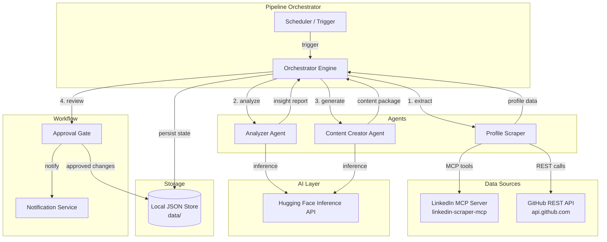
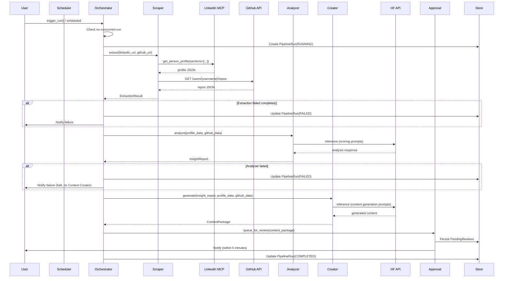
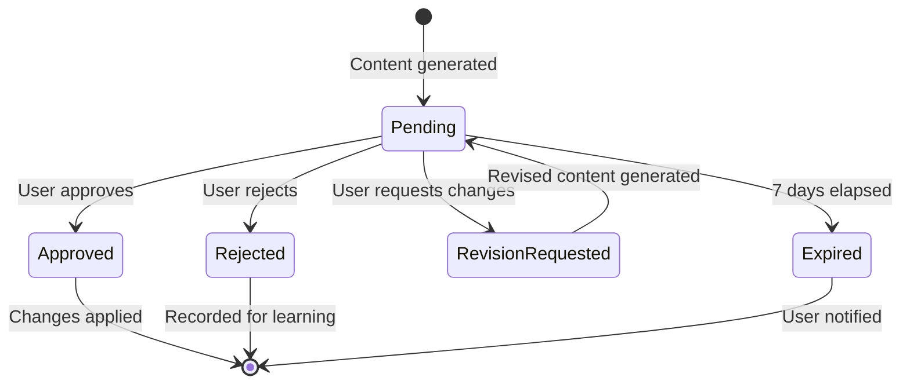

# Design Document: LinkedIn Profile Optimizer

## Overview

The LinkedIn Profile Optimizer is a Python-based multi-agent pipeline that analyzes a user's LinkedIn profile, scores each section, generates optimized content suggestions, and manages an approval workflow before applying changes. The system integrates three external data sources — LinkedIn (via MCP Server), GitHub (via REST API), and Hugging Face (for AI inference) — coordinated by a pipeline orchestrator with scheduling support.

The architecture follows an agent-based design where specialized agents (Analyzer and Content Creator) operate on structured data models, passing results through a pipeline that enforces sequential execution, error handling, and human-in-the-loop approval gates.

### Key Design Decisions

1. **MCP Protocol for LinkedIn access**: The `linkedin-scraper-mcp` server provides browser-based scraping via `get_person_profile`, `get_my_profile`, `get_feed`, and `search_people` tools. This avoids maintaining LinkedIn authentication logic directly.
2. **GitHub REST API (unauthenticated for public data)**: Since the target GitHub profile is public, we use the GitHub REST API v3 without authentication for basic data extraction (repos, contributions, languages).
3. **Hugging Face Inference API**: Models are invoked via the HF Inference API for both analysis and content generation, with configurable model IDs and fallback support.
4. **Local file-based persistence**: Pipeline state, approval queues, engagement baselines, and reports are stored as JSON files in a local `data/` directory, keeping the system simple and self-contained.
5. **APScheduler for scheduling**: Python's APScheduler library handles cron-based and interval-based pipeline execution without requiring external infrastructure.

## Architecture



### Component Responsibilities

| Component | Responsibility |
|-----------|---------------|
| **Scheduler** | Triggers pipeline runs (cron, interval, or on-demand) |
| **Orchestrator Engine** | Sequences agent execution, manages state, handles errors |
| **Profile Scraper** | Extracts LinkedIn + GitHub data into structured format |
| **Analyzer Agent** | Scores sections, generates insights using HF models |
| **Content Creator Agent** | Generates optimized content using HF models |
| **Approval Gate** | Manages human review workflow with approve/reject/modify |
| **Notification Service** | Sends alerts for pending approvals, expirations |
| **Local JSON Store** | Persists profiles, reports, content packages, engagement data |

## Components and Interfaces

### Profile Scraper

The Profile Scraper orchestrates data extraction from LinkedIn (via MCP) and GitHub (via REST API).

```python
class ProfileScraper:
    """Extracts profile data from LinkedIn and GitHub."""

    async def extract_linkedin_profile(self, profile_url: str) -> ProfileData:
        """
        Calls linkedin-mcp-server tools to extract all profile sections.
        Uses get_person_profile with section selection for:
        experience, education, skills, projects, posts, contact_info.
        Uses get_my_profile for authenticated user's own profile.
        
        Implements retry with exponential backoff (2s base, max 3 attempts).
        """
        ...

    async def extract_github_profile(self, github_url: str) -> GitHubData:
        """
        Calls GitHub REST API endpoints:
        - GET /users/{username}/repos (public repos)
        - GET /users/{username}/events (contribution activity)
        - GET /users/{username} (profile metadata)
        
        Timeout: 15 seconds per request.
        Graceful degradation if unavailable.
        """
        ...

    async def extract(self, linkedin_url: str, github_url: str | None = None) -> ExtractionResult:
        """Full extraction pipeline with error aggregation."""
        ...
```

**MCP Integration Pattern**: The scraper communicates with the LinkedIn MCP Server through the MCP client protocol. The MCP server manages a browser session (Patchright/Chromium) and provides structured JSON responses for each tool call.

```python
# MCP tool invocation pattern
async def _call_mcp_tool(self, tool_name: str, arguments: dict) -> dict:
    """Invoke a linkedin-mcp-server tool via MCP protocol."""
    result = await self.mcp_client.call_tool(tool_name, arguments)
    return result.content
```

### Analyzer Agent

```python
class AnalyzerAgent:
    """Scores profile sections and generates actionable insights."""

    def __init__(self, model_id: str, fallback_model_id: str | None = None):
        self.model_id = model_id
        self.fallback_model_id = fallback_model_id

    async def analyze(self, profile_data: ProfileData, github_data: GitHubData | None) -> InsightReport:
        """
        Scores each section, generates strengths/weaknesses/recommendations.
        Uses HF model for qualitative assessment with structured prompts.
        """
        ...

    def score_headline(self, headline: str, target_role: str | None) -> SectionScore:
        """Score headline based on keywords, length, value proposition."""
        ...

    def score_about(self, about: str, target_role: str | None) -> SectionScore:
        """Score about section based on narrative, keywords, CTA, length."""
        ...

    def score_experience(self, entries: list[ExperienceEntry]) -> SectionScore:
        """Score experience based on metrics, action verbs, alignment."""
        ...

    def score_skills(self, skills: list[Skill], target_role: str | None) -> SectionScore:
        """Score skills based on alignment, endorsements, pinned skills."""
        ...

    def score_posts(self, posts: list[Post], follower_count: int) -> SectionScore:
        """Score posts based on engagement rate, frequency, topic alignment."""
        ...

    def score_media(self, banner: MediaInfo | None, photo: MediaInfo | None) -> SectionScore:
        """Score banner/photo based on presence, resolution, branding."""
        ...
```

### Content Creator Agent

```python
class ContentCreatorAgent:
    """Generates optimized content based on analysis insights."""

    def __init__(self, model_id: str, fallback_model_id: str | None = None):
        self.model_id = model_id
        self.fallback_model_id = fallback_model_id

    async def generate(self, insight_report: InsightReport, profile_data: ProfileData, github_data: GitHubData | None) -> ContentPackage:
        """Generate optimized content for all sections scoring below 70."""
        ...

    async def generate_headline(self, current: str, insights: SectionInsight, context: ProfileContext) -> ContentSuggestion:
        """Generate optimized headline within 220 chars."""
        ...

    async def generate_about(self, current: str, insights: SectionInsight, context: ProfileContext) -> ContentSuggestion:
        """Generate optimized about section within 2600 chars."""
        ...

    async def generate_experience(self, entries: list[ExperienceEntry], insights: SectionInsight, github_data: GitHubData | None) -> list[ContentSuggestion]:
        """Generate optimized experience bullets with metrics."""
        ...

    async def generate_post_ideas(self, profile_context: ProfileContext, github_data: GitHubData | None) -> list[PostIdea]:
        """Generate at least 3 post ideas with topic, format, outline."""
        ...

    async def generate_banner_suggestions(self, profile_context: ProfileContext) -> BannerSuggestion:
        """Generate banner design suggestions."""
        ...

    async def revise_suggestion(self, original: ContentSuggestion, feedback: str) -> ContentSuggestion:
        """Revise a suggestion based on user feedback."""
        ...
```

### Pipeline Orchestrator

```python
class PipelineOrchestrator:
    """Coordinates the full optimization pipeline."""

    async def run(self, config: PipelineConfig) -> PipelineRun:
        """
        Execute the full pipeline:
        1. Profile extraction (LinkedIn + GitHub)
        2. Analysis and scoring
        3. Content generation (for sections < 70)
        4. Queue for approval
        
        Halts on critical failures, logs all steps.
        Prevents concurrent executions (queues new triggers).
        """
        ...

    async def schedule(self, interval: ScheduleInterval) -> None:
        """Configure scheduled execution via APScheduler."""
        ...

    async def pause(self) -> None:
        """Pause scheduled executions."""
        ...

    async def resume(self) -> None:
        """Resume scheduled executions."""
        ...
```

### Approval Workflow

```python
class ApprovalWorkflow:
    """Manages human-in-the-loop content review."""

    async def queue_for_review(self, content_package: ContentPackage) -> str:
        """Queue content for user review, returns review_id."""
        ...

    async def get_pending_reviews(self) -> list[PendingReview]:
        """Get all pending reviews with side-by-side comparison data."""
        ...

    async def approve(self, suggestion_id: str) -> ApprovalResult:
        """Approve and apply a content suggestion."""
        ...

    async def reject(self, suggestion_id: str, reason: str | None = None) -> None:
        """Reject a suggestion with optional reason."""
        ...

    async def request_modification(self, suggestion_id: str, feedback: str) -> ContentSuggestion:
        """Request revision with user feedback (max 500 chars)."""
        ...

    async def expire_stale_reviews(self) -> list[str]:
        """Expire reviews older than 7 days."""
        ...
```

### Hugging Face Client

```python
class HuggingFaceClient:
    """Wrapper for Hugging Face Inference API with retry and fallback."""

    def __init__(self, primary_model: str, fallback_model: str | None = None, timeout: int = 30):
        self.primary_model = primary_model
        self.fallback_model = fallback_model
        self.timeout = timeout

    async def generate(self, prompt: str, system_prompt: str | None = None, conversation_history: list[dict] | None = None) -> str:
        """
        Generate text using HF Inference API.
        - Timeout: 30 seconds
        - Retry: 3 attempts with exponential backoff (2s base)
        - Fallback: switch to fallback model on primary failure
        - Maintains conversation context for consistency
        """
        ...
```

## Data Models

```python
from dataclasses import dataclass, field
from datetime import datetime
from enum import Enum
from typing import Optional


class SectionName(Enum):
    HEADLINE = "headline"
    ABOUT = "about"
    EXPERIENCE = "experience"
    SKILLS = "skills"
    POSTS = "posts"
    BANNER = "banner"
    PHOTO = "photo"
    EDUCATION = "education"


class Priority(Enum):
    HIGH = "high"
    MEDIUM = "medium"
    LOW = "low"


class ApprovalStatus(Enum):
    PENDING = "pending"
    APPROVED = "approved"
    REJECTED = "rejected"
    EXPIRED = "expired"
    REVISION_REQUESTED = "revision_requested"


class PipelineStatus(Enum):
    RUNNING = "running"
    COMPLETED = "completed"
    FAILED = "failed"
    QUEUED = "queued"


class ScheduleInterval(Enum):
    DAILY = "daily"
    WEEKLY = "weekly"
    MONTHLY = "monthly"


# --- Profile Data Models ---

@dataclass
class ExperienceEntry:
    title: str
    company: str
    duration: str
    description: str
    bullets: list[str] = field(default_factory=list)


@dataclass
class Skill:
    name: str
    endorsements: int = 0
    is_pinned: bool = False


@dataclass
class Post:
    content: str
    reactions: int = 0
    comments: int = 0
    shares: int = 0
    impressions: int = 0
    published_at: Optional[datetime] = None


@dataclass
class MediaInfo:
    url: Optional[str] = None
    width: Optional[int] = None
    height: Optional[int] = None
    is_custom: bool = False


@dataclass
class ProfileData:
    url: str
    headline: str = ""
    about: str = ""
    experience: list[ExperienceEntry] = field(default_factory=list)
    skills: list[Skill] = field(default_factory=list)
    education: list[dict] = field(default_factory=list)
    posts: list[Post] = field(default_factory=list)
    banner: Optional[MediaInfo] = None
    photo: Optional[MediaInfo] = None
    follower_count: int = 0
    connection_count: int = 0
    target_role: Optional[str] = None
    extracted_at: Optional[datetime] = None


# --- GitHub Data Models ---

@dataclass
class GitHubRepo:
    name: str
    description: str = ""
    stars: int = 0
    primary_language: Optional[str] = None
    is_pinned: bool = False
    url: str = ""


@dataclass
class GitHubData:
    username: str
    repos: list[GitHubRepo] = field(default_factory=list)
    commit_count_12m: int = 0
    pr_count_12m: int = 0
    issue_count_12m: int = 0
    primary_languages: list[str] = field(default_factory=list)
    commits_per_week_avg: float = 0.0
    notable_repos: list[GitHubRepo] = field(default_factory=list)
    extracted_at: Optional[datetime] = None
    partial_data: bool = False
    unavailable_categories: list[str] = field(default_factory=list)


# --- Scoring and Insight Models ---

@dataclass
class FactorScore:
    factor_name: str
    score: int  # 0-100
    weight: float  # 0.0-1.0
    explanation: str = ""


@dataclass
class SectionScore:
    section: SectionName
    score: int  # 0-100, weighted average of factor scores
    factors: list[FactorScore] = field(default_factory=list)
    is_missing: bool = False
    unavailable_factors: list[str] = field(default_factory=list)


@dataclass
class Recommendation:
    element: str  # what to change
    modification: str  # how to change it
    priority: Priority = Priority.MEDIUM
    guideline_reference: str = ""  # LinkedIn optimization guideline cited


@dataclass
class SectionInsight:
    section: SectionName
    score: SectionScore
    strengths: list[str]  # at least 1
    weaknesses: list[str]  # at least 1
    recommendations: list[Recommendation]  # at least 1; at least 2 if score < 70


@dataclass
class InsightReport:
    profile_url: str
    sections: list[SectionInsight]
    github_available: bool = True
    github_unavailability_reason: Optional[str] = None
    excluded_sections: list[SectionName] = field(default_factory=list)
    generated_at: Optional[datetime] = None


# --- Content Generation Models ---

@dataclass
class ContentSuggestion:
    id: str
    section: SectionName
    current_content: str
    proposed_content: str
    rationale: str
    character_count: int = 0
    keywords_used: list[str] = field(default_factory=list)


@dataclass
class PostIdea:
    topic: str
    format: str  # "text", "carousel", "poll", "video"
    outline: str  # at least 2 sentences
    derived_from: str = ""  # which expertise/audience info it came from


@dataclass
class BannerSuggestion:
    dimensions: tuple[int, int]  # (width, height) in pixels
    color_palette: list[str]  # up to 5 hex colors
    tagline: str  # max 10 words


@dataclass
class ContentPackage:
    id: str
    insight_report_id: str
    suggestions: list[ContentSuggestion] = field(default_factory=list)
    post_ideas: list[PostIdea] = field(default_factory=list)
    banner_suggestion: Optional[BannerSuggestion] = None
    generated_at: Optional[datetime] = None


# --- Approval Workflow Models ---

@dataclass
class PendingReview:
    id: str
    suggestion: ContentSuggestion
    status: ApprovalStatus = ApprovalStatus.PENDING
    created_at: Optional[datetime] = None
    expires_at: Optional[datetime] = None  # created_at + 7 days
    rejection_reason: Optional[str] = None
    modification_feedback: Optional[str] = None


# --- Pipeline and Engagement Models ---

@dataclass
class PipelineRun:
    id: str
    status: PipelineStatus
    start_time: datetime
    end_time: Optional[datetime] = None
    error: Optional[str] = None
    summary: Optional[str] = None
    profile_url: str = ""
    sections_analyzed: int = 0
    suggestions_generated: int = 0


@dataclass
class EngagementBaseline:
    change_id: str  # links to approved ContentSuggestion
    recorded_at: datetime
    profile_views: int = 0
    connection_requests: int = 0
    post_likes: int = 0
    post_comments: int = 0
    post_shares: int = 0
    post_impressions: int = 0


@dataclass
class EngagementSnapshot:
    baseline_id: str
    collected_at: datetime
    profile_views: int = 0
    connection_requests: int = 0
    post_likes: int = 0
    post_comments: int = 0
    post_shares: int = 0
    post_impressions: int = 0


@dataclass
class EngagementReport:
    baseline: EngagementBaseline
    current: EngagementSnapshot
    days_elapsed: int
    changes: dict[str, dict]  # metric -> {"absolute": int, "percentage": float}


# --- Configuration ---

@dataclass
class PipelineConfig:
    linkedin_url: str
    github_url: Optional[str] = None
    target_role: Optional[str] = None
    analyzer_model: str = "mistralai/Mistral-7B-Instruct-v0.3"
    creator_model: str = "mistralai/Mistral-7B-Instruct-v0.3"
    fallback_model: Optional[str] = "google/gemma-2-9b-it"
    schedule: Optional[ScheduleInterval] = None
    engagement_tracking_days: int = 30
```

## Pipeline Orchestration Design

### Execution Flow



### Concurrency Control

The orchestrator uses a simple lock mechanism:

```python
class PipelineOrchestrator:
    def __init__(self):
        self._lock = asyncio.Lock()
        self._queue: asyncio.Queue[PipelineConfig] = asyncio.Queue()

    async def run(self, config: PipelineConfig) -> PipelineRun:
        if self._lock.locked():
            await self._queue.put(config)
            return PipelineRun(status=PipelineStatus.QUEUED, ...)
        
        async with self._lock:
            return await self._execute(config)
```

### Scheduling Mechanism

```python
from apscheduler.schedulers.asyncio import AsyncIOScheduler
from apscheduler.triggers.cron import CronTrigger
from apscheduler.triggers.interval import IntervalTrigger

class PipelineScheduler:
    def __init__(self, orchestrator: PipelineOrchestrator):
        self.scheduler = AsyncIOScheduler()
        self.orchestrator = orchestrator

    def configure(self, interval: ScheduleInterval, config: PipelineConfig):
        trigger_map = {
            ScheduleInterval.DAILY: CronTrigger(hour=9),
            ScheduleInterval.WEEKLY: CronTrigger(day_of_week="mon", hour=9),
            ScheduleInterval.MONTHLY: CronTrigger(day=1, hour=9),
        }
        self.scheduler.add_job(
            self.orchestrator.run,
            trigger=trigger_map[interval],
            args=[config],
            id="pipeline_scheduled_run",
            replace_existing=True,
        )

    def pause(self):
        self.scheduler.pause_job("pipeline_scheduled_run")

    def resume(self):
        self.scheduler.resume_job("pipeline_scheduled_run")
```

## Approval Workflow Design



### Side-by-Side Comparison Format

```python
@dataclass
class ComparisonView:
    section: SectionName
    current_content: str
    proposed_content: str
    diff_highlights: list[str]  # key differences
    score_before: int
    estimated_score_after: int
    rationale: str
```

### Expiration and Notification

- A background task runs every hour checking for reviews where `expires_at < now()`
- Expired reviews are marked `EXPIRED` and the user is notified
- Notifications are delivered via configurable channels (initially: console output + local file log; extensible to email/webhook)

## Integration Points

### LinkedIn MCP Server Integration

| Tool | Usage | Error Handling |
|------|-------|----------------|
| `get_person_profile` | Extract profile sections for a given URL | Retry 3x with exponential backoff (2s base) |
| `get_my_profile` | Extract authenticated user's own profile | Same retry strategy |
| `get_feed` | Get recent posts for engagement analysis | Continue without if unavailable |
| `search_people` | Future: competitor analysis | Not used in initial pipeline |

**Connection**: The pipeline connects to the MCP server via standard MCP client protocol. The MCP server must be running (started via `uvx linkedin-scraper-mcp@latest`) with an authenticated browser session.

### GitHub API Integration

| Endpoint | Data Retrieved |
|----------|---------------|
| `GET /users/{username}` | Profile metadata, public repos count |
| `GET /users/{username}/repos?sort=stars&per_page=100` | Repositories with stars, language |
| `GET /users/{username}/events?per_page=100` | Contribution events (commits, PRs, issues) |

**Error Handling**: 15-second timeout, graceful degradation on failure (pipeline continues with LinkedIn-only analysis).

### Hugging Face Integration

The system uses the Hugging Face Inference API with two configured models:

- **Analyzer model**: For scoring rationale and insight generation
- **Creator model**: For content generation (may be same model)

**Conversation context**: Within a single pipeline run, conversation history is maintained across section analyses to ensure consistent tone and terminology.

**Retry strategy**: 3 attempts with exponential backoff (2s, 4s, 8s). On primary model failure after retries, switch to fallback model.

## Error Handling

| Scenario | Behavior |
|----------|----------|
| LinkedIn profile inaccessible | Return error, no partial data stored |
| Rate limiting on LinkedIn | Retry 3x with exponential backoff, then fail |
| Partial section extraction failure | Return error indicating failed sections |
| GitHub unavailable | Continue with LinkedIn-only, note in report |
| GitHub partial data | Proceed with available data, note gaps |
| HF model timeout (>30s) | Cancel, retry with fallback model |
| HF API error | Retry 3x with backoff, then use fallback |
| Analyzer failure | Halt pipeline, log error, notify user |
| Content Creator failure | Log error, notify user, partial results available |
| Concurrent pipeline trigger | Queue new trigger, execute after current completes |
| Engagement metrics unavailable | Retry 3x over 6 hours, log data gap |

### Error Propagation Strategy

```python
class PipelineError(Exception):
    """Base error for pipeline failures."""
    pass

class ExtractionError(PipelineError):
    """Raised when profile extraction fails."""
    def __init__(self, message: str, failed_sections: list[str] = None):
        self.failed_sections = failed_sections or []
        super().__init__(message)

class AnalysisError(PipelineError):
    """Raised when analysis fails — halts pipeline."""
    pass

class GenerationError(PipelineError):
    """Raised when content generation fails."""
    pass

class ModelUnavailableError(PipelineError):
    """Raised when both primary and fallback models fail."""
    pass
